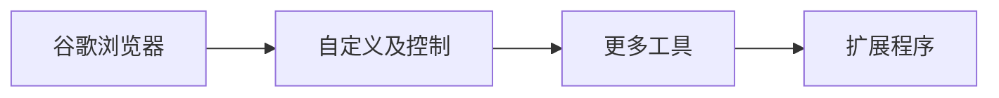

>由于国内网络环境的特殊性，一些常用的谷歌浏览器插件无法加载使用，自己折腾了几个小时终于成功，现在分享则个。

---
@[TOC](谷歌浏览器网页截屏插件工具下载与安装——FireShot: Full Webpage Screenshots + Annotations)
***
# 1、信息介绍

> 版本
0.98.97.2
上次更新日期
2019年11月29日
大小
2.84MiB
语言
查看全部32种支持的语言
开发者
contacts@getfireshot.com

* 官方链接 <u>==[**FireShot**](https://getfireshot.com/)==</u> 

---

# 2、下载与安装
## 2.1 crx插件下载 
* **链接：[GitHub 存档](https://github.com/Sun365/-FireShot/blob/master/mcbpblocgmgfnpjjppndjkmgjaogfceg_19776.crx)**

* **下载后解压缩备用**

## 2.2 安装示意
* **依次打开：**

* **选择“开发者模式”**

* 点击“**加载已解压的扩展程序**”并选择解压后的文件夹

* **安装成功并查看**

---
